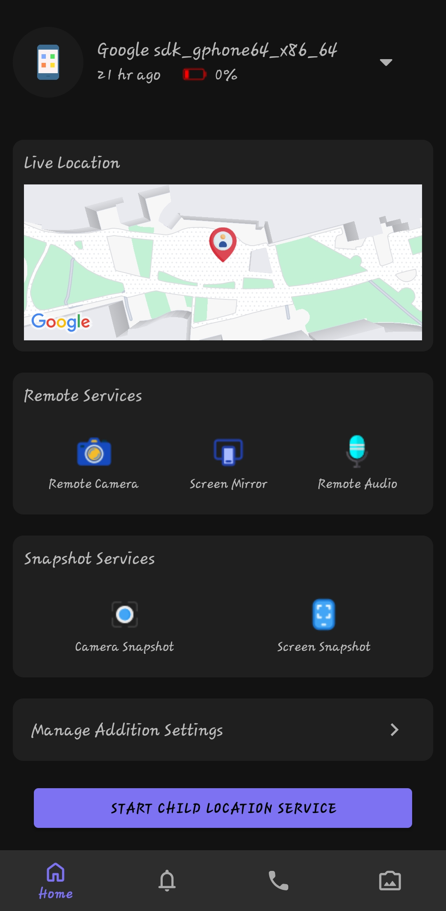
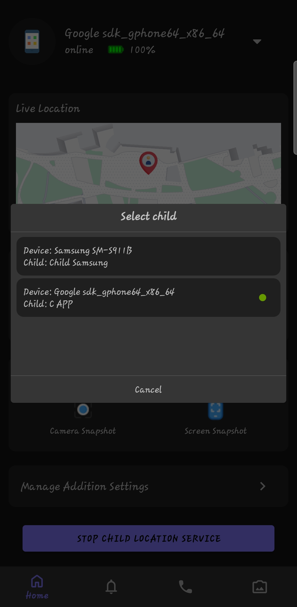
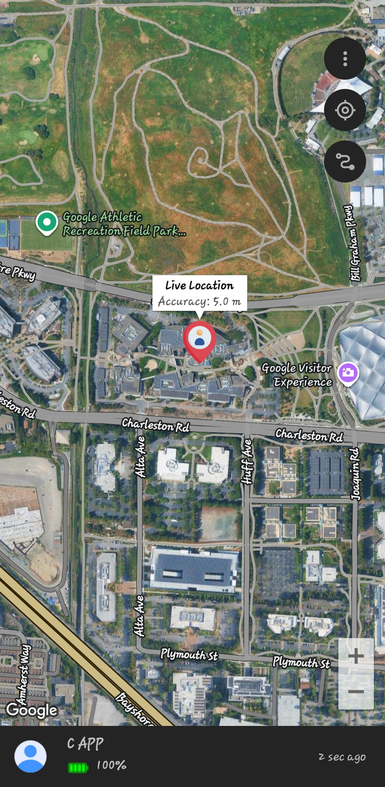
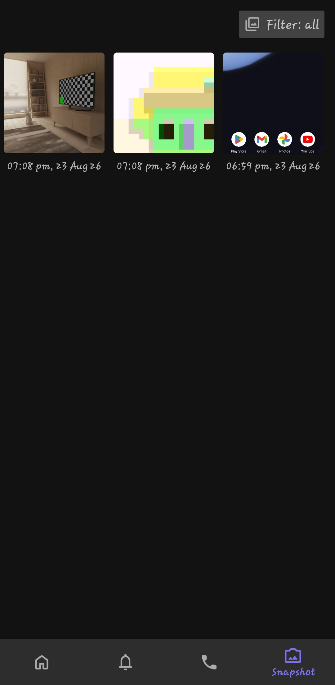
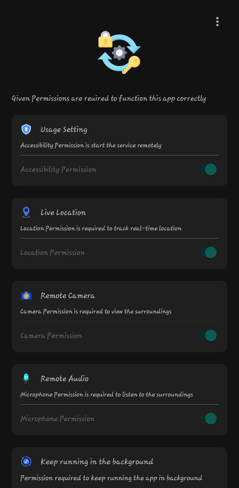

# ParentSync – Parental Control

ParentSync is a native Android parental-control system consisting of two companion applications that communicate through Firebase and WebRTC.

- **Parent App** – manages and communicates with the child's device.
- **Child App** – runs on the child's device and synchronizes data and communication with the Parent App.

Built with Java, Firebase and WebRTC.

---

## 📱 Features

### Parent App
- Parent authentication
- Child device management
- Real-time communication
- WebRTC audio/video communication
- Child location viewing
- Firebase-based synchronization

### Child App
- Child/device authentication
- Location synchronization
- Background/foreground services
- WebRTC communication
- Firebase synchronization
- Device-side parental-control functionality

---

## 🏗️ Architecture

```text
                 ParentSync
                     │
          ┌──────────┴──────────┐
          │                     │
          ▼                     ▼
     Parent App             Child App
          │                     │
          └──────────┬──────────┘
                     │
                     ▼
                  Firebase
              ┌──────┼──────┐
              │      │      │
             Auth   RTDB   Storage
                     │
                     ▼
                  WebRTC
```

---

## 🛠️ Tech Stack

- **Language:** Java
- **Platform:** Android
- **Backend:** Firebase
- **Database:** Firebase Realtime Database
- **Authentication:** Firebase Authentication
- **Storage:** Firebase Storage
- **Real-time Communication:** WebRTC
- **Networking:** OkHttp
- **Serialization:** Gson
- **Location:** Google Play Services Location
- **UI:** Material Components
- **Image Loading:** Glide
- **Animations:** Lottie
- **Build:** Gradle + Android Gradle Plugin
- **Code Optimization:** R8 / ProGuard

---

## 📂 Project Structure

```text
ParentSync-ParentalControl/
│
├── ParentApp-ParentSync/
│   └── app/
│
├── ChildApp-ParentSync/
│   └── app/
│
├── screenshots/
├── .gitignore
└── README.md
```

---

## ⚙️ Requirements

- Android Studio
- JDK compatible with the project
- Android SDK
- Android device/emulator

**Current build configuration:**

| Tool       | Version |
|------------|---------|
| AGP        | 9.1.1   |
| Gradle     | 9.3.1   |
| compileSdk | 37      |
| targetSdk  | 36      |
| minSdk     | 26      |

---

## 🚀 Setup

### 1. Clone the repository
```bash
git clone https://github.com/racks1401/ParentSync-Android
```

### 2. Configure Firebase for both applications

Each app needs its own `google-services.json`. Copy the provided example files and fill in your own Firebase project credentials:

```bash
cp ParentApp-ParentSync/app/google-services.json.example ParentApp-ParentSync/app/google-services.json
cp ChildApp-ParentSync/app/google-services.json.example ChildApp-ParentSync/app/google-services.json
```

Then open each `google-services.json` and replace the placeholder values with your actual Firebase project config (from the Firebase Console).

### 3. Build and run

Open `ParentApp-ParentSync` and `ChildApp-ParentSync` as separate projects in Android Studio, sync Gradle, and run each on a separate device/emulator.

---

## 🔐 Security

The project does **not** include:

- Firebase configuration files (`google-services.json`)
- API secrets
- `local.properties`
- Release keystores
- Signing passwords

Firebase Realtime Database should be configured with authenticated, user-specific security rules.

---

## 📸 Screenshots

### Parent App

<p align="center">
  
  
</p>

<p align="center">
  
  
</p>

### Child App

<p align="center">
  
</p>

---

## 👨‍💻 Author

**Ravi Kumar Prabudh**
Android Developer | MCA (AI & IoT)

---

## 📥 Demo

Download the Android applications:

- [Parent App APK](https://github.com/racks1401/ParentSync-Android/releases/download/v1.1/ParentSync-ParentApp-1.1-release.apk)
- [Child App APK](https://github.com/racks1401/ParentSync-Android/releases/download/v1.1/ParentSync-ChildApp-1.1-release.apk)

> Parent and Child apps are companion applications and should be installed together for a complete demo.

---

⭐ If you find the project interesting, consider giving it a star.
